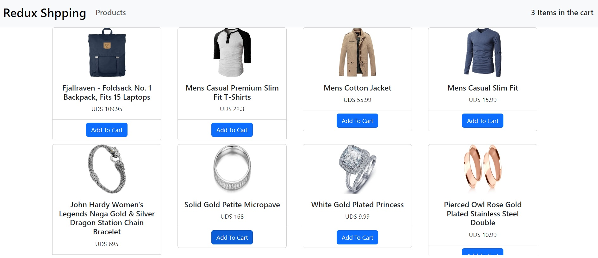

# Redux-Shopping Project

Redux-Shopping is a dummy shopping website created to practice working with Redux, Redux-React, and its middlewares. The project utilizes Bootstrap and React-Bootstrap for styling and interacts with the [FakeStoreAPI](https://fakestoreapi.com/) to fetch fake products for the shopping experience.

## Table of Contents

- [Redux-Shopping Project](#redux-shopping-project)
  - [Table of Contents](#table-of-contents)
  - [Introduction](#introduction)
  - [Features](#features)
  - [MockUp](#mockup)
  - [Getting Started](#getting-started)
    - [Prerequisites](#prerequisites)
    - [Installation](#installation)
  - [Usage](#usage)
  - [Technologies Used](#technologies-used)
  - [Contributing](#contributing)
  - [License](#license)
  - [Contact](#contact)

## Introduction

Redux-Shopping is a simple e-commerce website built as a learning project to understand and implement Redux and its related libraries in a React application. The project emulates the typical user flow of an e-commerce platform, allowing users to browse products, add items to their shopping cart, and proceed to the checkout.

## Features

- Fetches products from the [FakeStoreAPI](https://fakestoreapi.com/) to create a realistic shopping experience.
- View a list of products with their details, including name, price and images.
- Add items to the shopping cart and update quantities.
- Remove items from the cart.
- Utilizes Redux for managing the application state efficiently.

## MockUp




## Getting Started

### Prerequisites

Make sure you have the following tools installed on your system:

- Node.js and npm (Node Package Manager)

### Installation

1. Clone the repository from GitHub:

   ```bash
   git clone https://github.com/parisadarkhal/redux-shopping.git
   ```

2. Navigate to the project directory:

   ```bash
   cd redux-shopping
   ```

3. Install the project dependencies:

   ```bash
   npm install
   ```

## Usage

To start the development server and view the project, run the following command:

```bash
npm start
```

The application will be accessible in your browser at `http://localhost:3000`.

## Technologies Used

The project utilizes the following technologies:

- React: A JavaScript library for building user interfaces.
- Redux: A predictable state container for managing the application state.
- Redux-React: Official Redux bindings for React.
- Redux Middlewares: Middleware library `redux-thunk` was used to handle asynchronous actions.
- Bootstrap: A popular CSS framework for styling the UI components.
- React-Bootstrap: React components implementation for Bootstrap styles.

## Contributing

Contributions to the Redux-Shopping project are welcome! If you have any suggestions or find any issues, feel free to open an issue or create a pull request.

Before submitting a pull request, please ensure that your changes are well-tested and adhere to the project's coding standards.

## License

This project is licensed under the [MIT License](LICENSE).

## Contact

For any inquiries or questions, you can reach out to the project creator:

- Name: Your Name
- Email: p.darkhal@gmail.com
- GitHub: [Your GitHub Profile](https://github.com/parisadarkhal)
